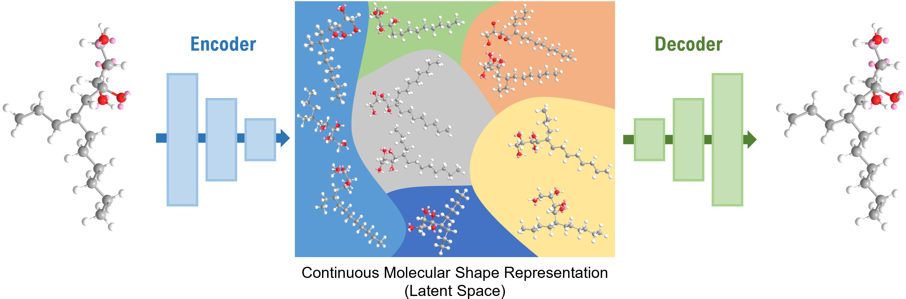

# VAE-Based SMILES String Generator

This project is a Variational Autoencoder (VAE)-based molecular SMILES string generator. It generates molecules composed of CHOH/CH2OH (referred to as A) and CH/CH2/CH3 (referred to as B) repeat units. The generated molecules are saturated and contain no rings. 



## Project Structure

The project consists of the following Python scripts:

- `VAE.py`: Defines the VAE model and includes functions for training and testing the model.
- `generate.py`: Generates new SMILES strings by perturbing the latent space of the trained VAE.
- `interpolate.py`: Generates interpolated SMILES strings between two given SMILES strings using the latent space of the trained VAE.
- `synthetic_dataset.py`: Generates a synthetic dataset of SMILES strings based on specified constraints.

## Features

- Generates over 100,000 synthetic SMILES strings.
- Only A and B repeat units are included.
- No molecule contains more than six consecutive A repeat units.
- All molecules in the dataset are saturated and contain no rings.

## Installation

1. Clone the repository:
    ```bash
    git clone https://github.com/DaoyuanLi2816/Molecule-Generator.git
    cd Molecule-Generator
    ```

2. Install the required dependencies:
    ```bash
    pip install -r requirements.txt
    ```

3. Ensure you have RDKit installed. RDKit is required for molecular operations. Installation instructions can be found [here](https://www.rdkit.org/docs/Install.html).

## Usage

### Generating Synthetic Dataset

To generate a synthetic dataset of SMILES strings, run `synthetic_dataset.py`:
```bash
python synthetic_dataset.py
```
This will create a CSV file named `molecules.csv` containing the generated SMILES strings.

### Training the VAE Model

To train the VAE model, run `VAE.py`:
```bash
python VAE.py
```
This will train the VAE model on the generated dataset and save the trained model as `beta_tc_vae_model.pth`.

### Generating New SMILES Strings

To generate new SMILES strings using the trained VAE model, run `generate.py`:
```bash
python generate.py
```
This will output new SMILES strings generated by perturbing the latent space of the trained VAE.

### Interpolating Between Two SMILES Strings

To generate interpolated SMILES strings between two given SMILES strings, run `interpolate.py`:
```bash
python interpolate.py
```
This will output SMILES strings that are interpolations between the two input SMILES strings in the latent space of the trained VAE.


## Contributing

If you would like to contribute to this project, please open an issue or submit a pull request. We welcome contributions from the community.

## License

This project is licensed under the MIT License. See the [LICENSE](LICENSE) file for details.
